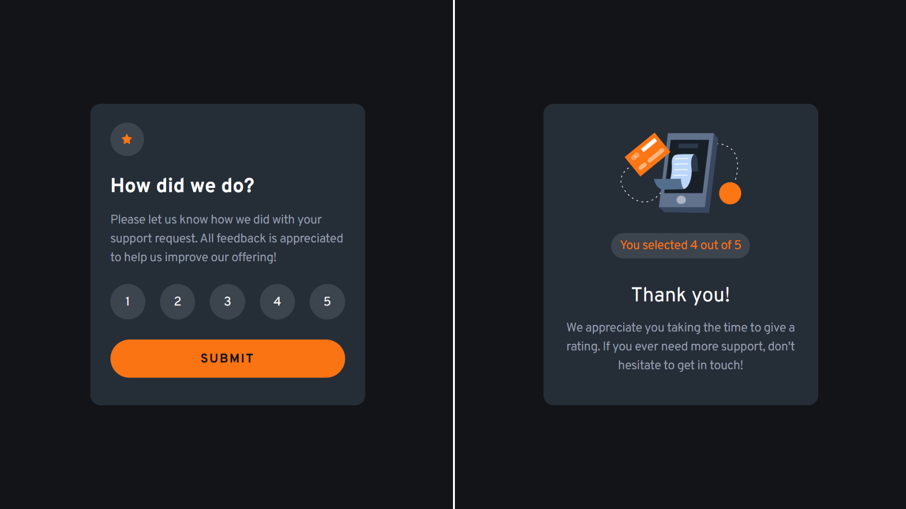
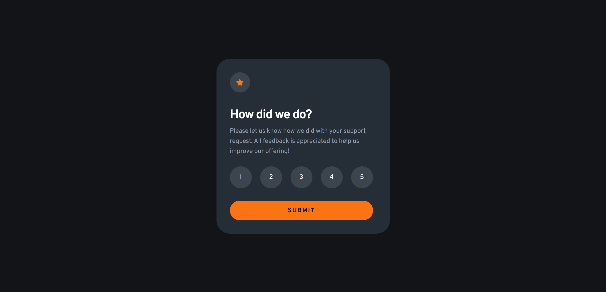
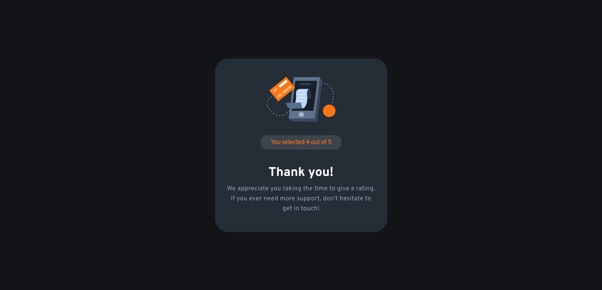

# Frontend Mentor - Interactive rating component solution

Esta é a minha solução para o desafio [Interactive rating component](https://www.frontendmentor.io/challenges/interactive-rating-component-koxpeBUmI) do Frontend Mentor.

Este desafio faz parte da trilha de aprendizado sobre acessibilidade do Frontend Mentor e foi uma oportunidade para praticar não apenas a construção visual de uma interface, mas também o uso de HTML semântico, navegação por teclado e gerenciamento de foco.

## Índice

- [Visão geral](#visão-geral)
  - [O desafio](#o-desafio)
  - [Screenshot](#screenshot)
  - [Links](#links)
- [Meu processo](#meu-processo)
  - [Construído com](#construído-com)
  - [O que aprendi](#o-que-aprendi)
  - [Desenvolvimento contínuo](#desenvolvimento-contínuo)
  - [Recursos úteis](#recursos-úteis)
  - [Colaboração com IA](#colaboração-com-ia)
- [Autora](#autora)
- [Agradecimentos](#agradecimentos)

## Visão geral

### O desafio

Os usuários devem ser capazes de:

- Visualizar o layout ideal da aplicação de acordo com o tamanho da tela do dispositivo;
- Visualizar os estados de hover dos elementos interativos;
- Selecionar uma nota de 1 a 5;
- Enviar a avaliação;
- Visualizar o estado de agradecimento após o envio;
- Navegar e interagir com o formulário utilizando apenas o teclado;
- Receber feedback visual para os estados de seleção e foco.

Além dos requisitos visuais do desafio, aproveitei o projeto para praticar conceitos de acessibilidade, utilizando elementos HTML nativos sempre que possível e garantindo que a mudança para o estado de agradecimento não causasse perda de contexto para usuários que navegam pelo teclado.

### Screenshot

#### Mobile (form/submited)


#### Desktop (form)


#### Desktop (submited)


### Links

- Live Site URL: [Interactive Rating Component](https://isabela-fernanda.github.io/interactive-rating-component/)

## Meu processo

### Construído com

- HTML5 semântico
- React
- TypeScript
- Tailwind CSS
- Vite
- Flexbox
- CSS custom properties através do sistema de temas do Tailwind
- Mobile-first workflow
- Acessibilidade e navegação por teclado

### O que aprendi

Este foi um dos projetos em que mais me preocupei com a estrutura da interface antes de começar a trabalhar no visual.

#### HTML semântico e acessibilidade

Utilizei elementos nativos de formulário, como `form`, `fieldset`, `legend`, `label` e `input type="radio"`, permitindo que o navegador fornecesse grande parte do comportamento de acessibilidade de forma nativa.

Por exemplo, em vez de criar os controles de avaliação utilizando elementos genéricos, mantive os radios reais:

```tsx
<input
  type="radio"
  name="rating"
  value={value}
  checked={rating === value}
  onChange={() => onRatingChange(value)}
  required
  className="peer sr-only"
/>
```

Isso permitiu manter comportamentos importantes, como navegação entre as opções utilizando as teclas direcionais e seleção utilizando `Space`, sem precisar recriar esses comportamentos manualmente com JavaScript.

#### Customização visual sem perder a acessibilidade

Outro aprendizado importante foi descobrir como esconder visualmente um `input` sem removê-lo da interação.

Em vez de utilizar `display: none`, utilizei `sr-only`, mantendo o controle de formulário acessível enquanto o elemento visual é construído com CSS:

``` tsx
<input
  type="radio"
  className="peer sr-only"
/>

<span className="peer-focus-visible:ring-2 peer-focus-visible:ring-orange-500">
  {value}
</span>
```

Dessa forma, o radio continua sendo o elemento que recebe foco, enquanto o `span` apresenta visualmente esse estado.

#### Gerenciamento de foco

O desafio também me fez perceber que acessibilidade não envolve apenas adicionar atributos `aria-*`.

Depois do envio do formulário, o formulário é removido da interface e substituído pelo estado de agradecimento. Isso significa que o elemento que possuía foco deixa de existir.

Para evitar que o usuário perca o contexto, movi o foco para o título do novo estado utilizando `useRef` e `useEffect`:

``` tsx
const headingRef = useRef<HTMLHeadingElement>(null);

useEffect(() => {
  headingRef.current?.focus();
}, []);
```

O título utiliza `tabIndex={-1}` para que possa receber foco programaticamente sem entrar na ordem normal de navegação por `Tab`.

Esse foi provavelmente o principal aprendizado deste projeto: uma interface acessível precisa considerar o que acontece com o foco quando o conteúdo da página muda.

### Desenvolvimento contínuo

Nos próximos projetos, quero continuar aprofundando meus conhecimentos em acessibilidade, especialmente em:

- Uso adequado de HTML semântico;
- Gerenciamento de foco em interfaces dinâmicas;
- Navegação por teclado;
- Uso consciente de atributos `aria-*`;
- Testes com diferentes tecnologias assistivas;
- Criação de componentes customizados que preservem os comportamentos nativos dos elementos HTML.

Também quero continuar praticando a separação de componentes em React sem criar abstrações desnecessárias para interfaces pequenas.

### Recursos úteis
- [Frontend Mentor](https://www.frontendmentor.io/) - Plataforma utilizada para o desafio e para praticar a construção de interfaces a partir de designs reais.
- [MDN - `<input type="radio">`](https://developer.mozilla.org/en-US/docs/Web/HTML/Reference/Elements/input/radio) - Referência utilizada para entender o comportamento nativo dos grupos de radio buttons.
- [MDN - `<fieldset>`](https://developer.mozilla.org/en-US/docs/Web/HTML/Reference/Elements/fieldset) - Referência sobre a estrutura semântica utilizada para agrupar as opções de avaliação.
- [MDN - tabindex](https://developer.mozilla.org/en-US/docs/Web/HTML/Reference/Global_attributes/tabindex) - Referência utilizada para entender o uso de `tabindex="-1"` no gerenciamento programático de foco.
- [Tailwind CSS](https://tailwindcss.com/) - Documentação utilizada para a estilização da interface.

### Colaboração com IA

Utilizei o ChatGPT como ferramenta de apoio durante o desenvolvimento do projeto.

A colaboração foi principalmente voltada para:

- Discutir a estrutura semântica do formulário antes de iniciar a estilização;
- Entender como preservar o comportamento nativo dos elementos `radio`;
- Investigar problemas relacionados à navegação por teclado;
- Entender o uso de `useRef` e `useEffect` para gerenciamento de foco;
- Revisar decisões relacionadas à acessibilidade;
- Esclarecer dúvidas durante a implementação e depuração do projeto.

A implementação e as decisões finais sobre a estrutura e o código foram feitas por mim. A IA foi utilizada como uma ferramenta de aprendizado e revisão, especialmente para discutir alternativas e entender os motivos por trás das soluções adotadas.

## Autora
Frontend Mentor - [@Isabela-Fernanda](https://www.frontendmentor.io/profile/Isabela-Fernanda)
GitHub - [@Isabela-Fernanda](https://github.com/Isabela-Fernanda)

## Agradecimentos

Agradeço ao Frontend Mentor pelo desafio e pela trilha de aprendizado sobre acessibilidade.

Este projeto foi especialmente útil para perceber que acessibilidade não precisa significar adicionar complexidade à aplicação. Muitas vezes, utilizar corretamente os elementos HTML nativos e seus comportamentos já fornece uma base bastante sólida.